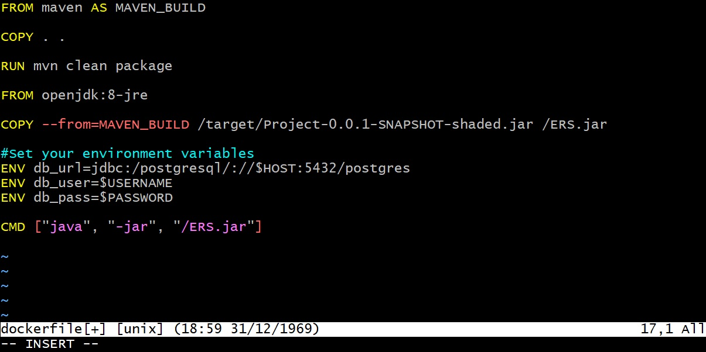
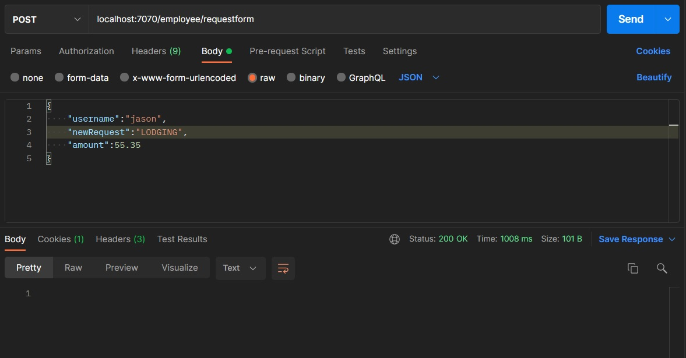

# REST API
## Description
The Employee Reimbursement System (ERS) is a REST API that helps manage the process of reimbursing employees for expenses. 
Employees can be created and edited via the API. Expenses for employees can be added and updated to pending and approved. Monitoring is also implemented, using Prometheus and Grafana.
## Technologies Used
* JDK 8
* Javalin 4.6.0
* Postgres 13.4-R1
* AWS EC2 AMI Kernel 5.10
* Prometheus
* Grafana
* Docker
* Postman
## Getting Started
First, you should create a work-space and clone this repo. I have included a screenshot of a sample Dockerfile which includes a section for adding environment variables.
 
## Usage
With the ERS up and running, you should be able to verify the endponts found in RequestMapping. You should now be able to send and
receive objects as `raw JSON`, such as in the screenshot below. Using Prometheus as your data source, you can monitor login attempts by creating a
panel and querying `total_login_attempts`. 
